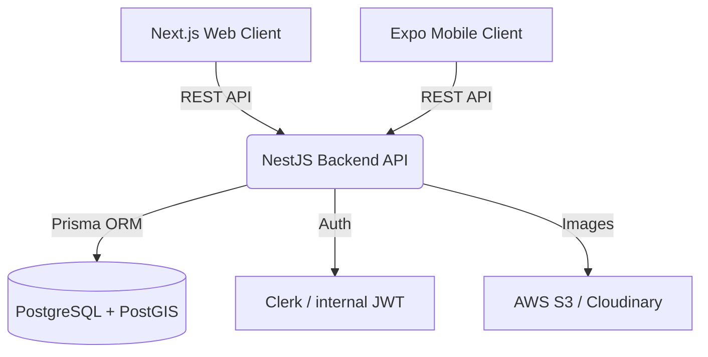

# Product Requirements Document (PRD)

## 1. Project Overview
The Institute Tracking Platform is a comprehensive directory (Web + Mobile) that lists private institutes, tutoring centers, and learning centers in Greece/Cyprus. It allows users to search, filter by subject, sort by distance, and contact institutes. It provides a portal for institute owners to manage their listings and an admin panel for overall platform management. 

## 2. Target Audience & Roles
- **Guest**: Can browse, search with filters (including geolocation), view institute details, and send contact requests without an account.
- **User**: Registered users who can save "Favorites", keep a history of contact requests, and write reviews (future).
- **Institute Owner**: Manages their institute(s), branches, services, schedules, media (photos), and receives contact inquiries.
- **Admin**: Has full systemic control. Approves listings, manages master data (services/cities/areas), handles reports, and oversees system health.

## 3. Minimum Viable Product (MVP) Features
- **User Facing**: 
  - Geolocation-based search ("Near me", distance in km, manual city/area entry).
  - Search by service/subject (e.g., Μαθηματικά, Αγγλικά).
  - List and Map views.
  - Institute profile page (Address, Schedule, Services, Contact Details).
  - Send direct "Contact Request / Inquiry" to the institute.
  - "Save to Favorites" (requires account).
- **Owner Facing**:
  - Secure registration and profile creation.
  - Add/Edit Institute details.
  - Add multiple physical branches (each with its own coordinates and schedule).
  - Select predefined services/subjects.
  - View incoming contact requests.
- **Admin Facing**:
  - Approve new institutes/branches.
  - Manage dynamic taxonomy (Seed categories like Μαθηματικά, Φυσική, etc.).
  - Moderate contact requests if necessary.

## 4. Technical Architecture
The platform follows a modular Client-Server architecture:
- **Client - Web**: Next.js App Router for SEO-friendly, fast SSR pages.
- **Client - Mobile**: React Native (Expo) for shared iOS/Android codebase.
- **Backend API**: NestJS (Node.js) providing a robust, highly-structured RESTful API.
- **Database**: PostgreSQL with PostGIS extension for advanced geospatial queries.
- **ORM**: Prisma for type-safe database access.
- **Authentication**: JWT / Clerk integration for secure identity management.
- **Storage**: AWS S3 or Cloudinary for image uploads.
- **Notifications**: Firebase Cloud Messaging (FCM) & SendGrid (Email).

## 5. Non-Functional Requirements
- **Performance**: API responses under 200ms utilizing geospatial indexing.
- **Scalability**: Dockerized backend, ready to deploy via load-balanced environments (Vercel/AWS/Render).
- **Security**: Strict Role-Based Access Control (RBAC). Sensitive data encryption. Rate-limiting on public API endpoints (esp. contact forms).
- **Localization**: Full Greek language support natively built-in natively into the platform schemas and frontends.
